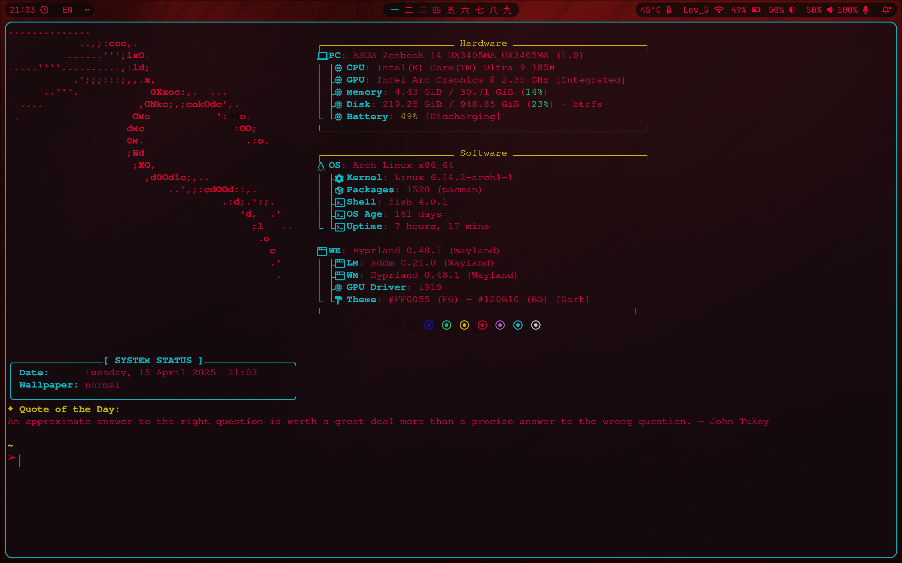
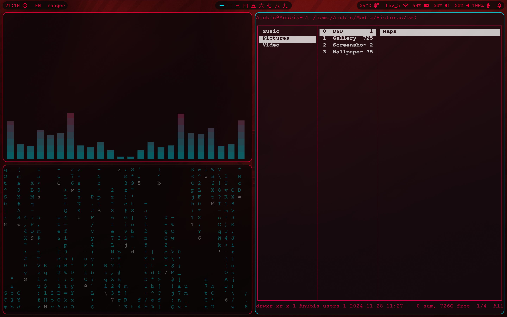
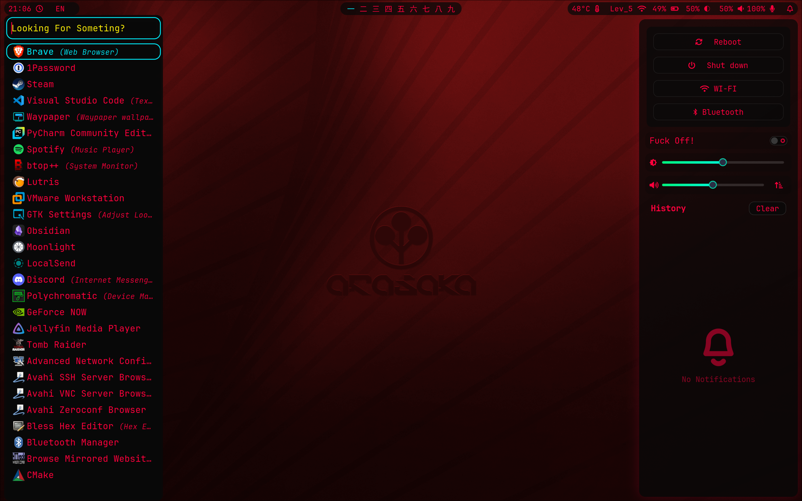
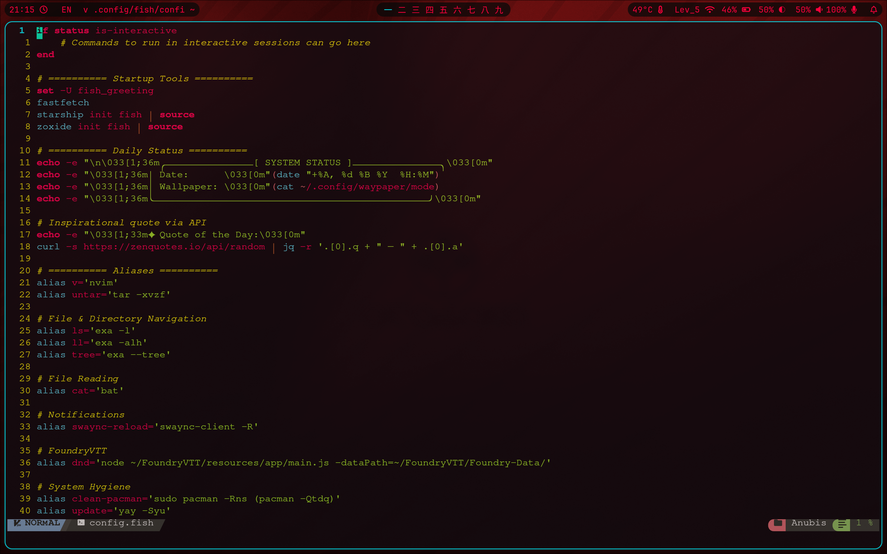

<h1 align="center">🌌 Cyber-Arch — Hyprland Dotfiles by Anubis</h1>

<p align="center">
  
</p>

<p align="center">
  <b>A custom, cohesive, cyberpunk-themed Arch Linux setup built around Hyprland</b><br>
  Minimal, sleek, and bursting with neon vibes ⚡
</p>

---

## ✨ Features

- 🔷 **Wayland window manager**: Hyprland with animations and tiling
- 🧠 **Custom Rofi menus**: Wi-Fi, Bluetooth, Emoji board, Clipboard manager
- 🌌 **Waybar**: Styled top bar with Unicode workspaces & integrated notifications
- 🎨 **Kitty + Starship**: Cyberpunk terminal with full nerd-font support
- 🎧 **SwayNC**: Beautiful notification center with control toggles
- 🖼️ **Waypaper + swww**: Dynamic animated wallpapers with mode toggle
- 🐚 **Fish shell**: Lightning fast with starship prompt and helpful aliases
- ⚙️ **Fastfetch**: Custom system info splash with themed layout
- 🧩 **NvChad Neovim**: Tweaked theme and language support for coding
- 📁 **Ranger**: File manager with image and PDF previews inside Kitty

---

## 📸 Screenshots

| Terminal | Waybar | Rofi | Neovim |
|---------|--------|------|--------|
|  |  |  |  |

---

## 🧩 Dependencies

This setup expects the following side tools to be installed:

| Tool | Purpose |
|------|---------|
| `zoxide` | Better `cd` navigation |
| `bat` | Syntax-highlighted `cat` replacement |
| `fastfetch` | System fetch splash |
| `cava` | Terminal visualizer |
| `cmatrix` | Matrix-themed eye candy |
| `blueman` | Bluetooth GUI |
| `swww` | Animated wallpaper daemon |
| `wl-clipboard` | Clipboard support for Wayland |
| `python-pywal` | Used by wallpaper scripts |
| `playerctl` | MPRIS integration for volume/media |
| `jq`, `fzf` | Used in scripting & fuzzy matching |
| `rofi-wayland` | Application launcher & menu frontend |
| `kitty` | GPU-accelerated terminal with image support |
| `neovim` | Editor of choice (with NvChad) |

> 📦 Most of these are installed via `yay` on Arch Linux.

---

## 📁 Included Configs
cava/           → Visualizer in terminal with neon look
fastfetch/      → Custom themed system info
fish/           → Fish shell config + aliases + starship prompt
hypr/           → Hyprland window manager config & helper scripts
nvim/           → NvChad setup with LSP, formatter & cyberpunk colors
ranger/         → File manager with image & PDF previews
rofi/           → Custom scripts: Wi-Fi, Bluetooth, Emoji board, Clipboard & more
starship.toml   → Cyberpunk terminal prompt with Git & language info
swaync/         → Notification center with control toggles (Wi-Fi, BT, etc.)
waybar/         → Top bar with Unicode workspaces, media controls & more

cyberpunk.rasi  → Unified style across all Rofi popups

---

## 🚀 Installation Guide

> ⚠️ This is not an install script. It assumes you're familiar with managing your own dotfiles.

git clone https://github.com/CyberAnpu/Cyber-Arch.git
cd Cyber-Arch

# Copy configs manually or symlink using stow
cp -r .config/* ~/.config/
cp -r .local/share/rofi ~/.local/share/rofi

Then install missing packages (see Dependencies section), and restart your Hyprland session.

---

- This system comes with multiple Rofi-powered custom menus under:
- wifi.sh → Toggle and connect to Wi-Fi networks
- bluetooth.sh → Trust, connect, or disconnect devices
- clipboard.sh → Scrollable clipboard history with pin support

Each script launches in a custom-styled Rofi window for the ultimate visual coherence.

💬 Credits
Built with ❤️ by CyberAnpu

Rofi theme based on Newman Sanchez's Rounded Cyberpunk

Inspired by the beautiful setups from r/unixporn

<p align="center"> <i>Live neon. Hack beautiful.</i> </p> ```
